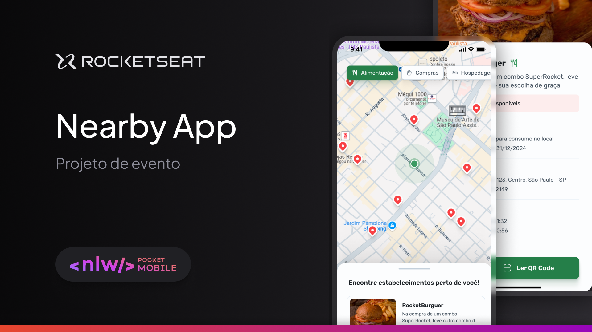

<div align="center" id="top"> 
  

&#xa0;

</div>

<h1 align="center">Nearby App</h1>

## :dart: About

The project is a mobile app for a benefits club featuring coupons to use at nearby establishments.
This is a project from the NLW Pocket Mobile event, one of the content offerings available to Rocketseat students.

## :rocket: Technologies

The following tools were used in this project:

<!-- - [Expo](https://expo.io/)
- [Node.js](https://nodejs.org/en/)
- [React](https://pt-br.reactjs.org/)
- [React Native](https://reactnative.dev/)
- [TypeScript](https://www.typescriptlang.org/) -->

<!-- ## :white_check_mark: Requirements

Before starting :checkered_flag:, you need to have [Git](https://git-scm.com) and [Node](https://nodejs.org/en/) installed.

## :checkered_flag: Starting

```bash
# Clone this project
$ git clone https://github.com/{{YOUR_GITHUB_USERNAME}}/nlw

# Access
$ cd nlw

# Install dependencies
$ yarn

# Run the project
$ yarn start

# The server will initialize in the <http://localhost:3000>
``` -->

Made with :heart: by <a href="https://github.com/davi1985" target="_blank">Davi Silva</a>

&#xa0;

<a href="#top">Back to top</a>
